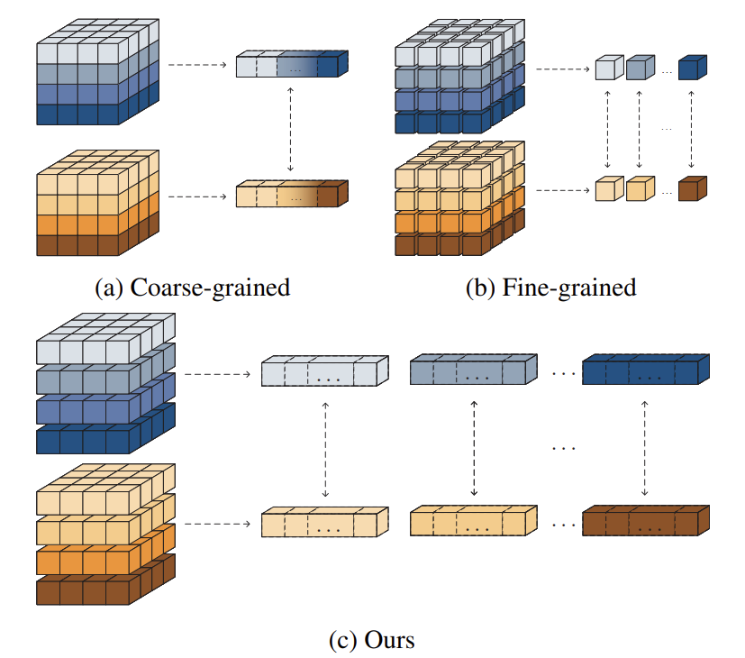
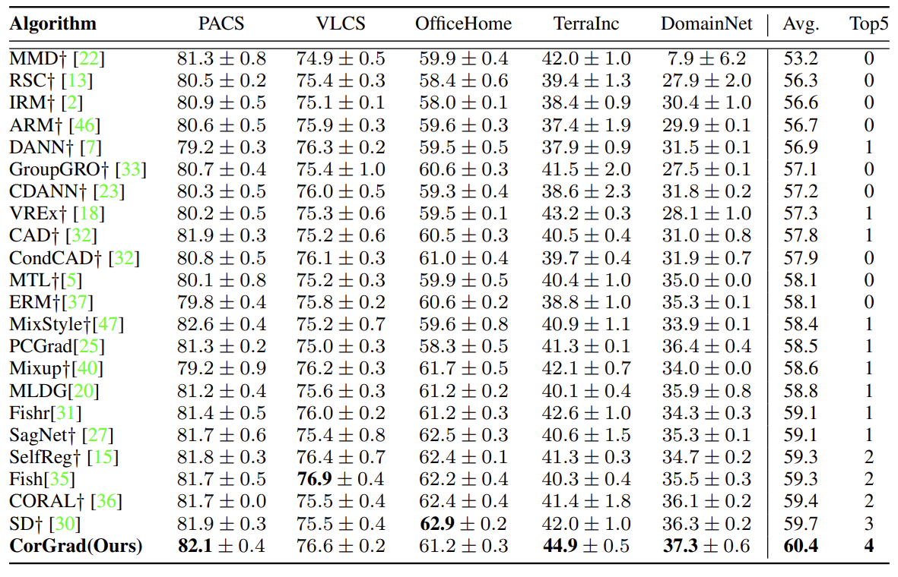

# Rethinking Domain Generalization from Perspective of Gradient Granularity (ECAI 2024)

Official PyTorch implementation of Rethinking **Domain Generalization from Perspective of Gradient Granularity**.

Yujie Zhou, Haigen Hu, Qianwei Zhou, Qiu Guan and Mingfeng Jiang.

<p align="center">
    
</p>

Note that this project is built upon [DomainBed@3fe9d7](https://github.com/facebookresearch/DomainBed/tree/3fe9d7bb4bc14777a42b3a9be8dd887e709ec414).

## Preparation

### Dependencies

```sh
pip install -r requirements.txt
```

### Datasets

```sh
python -m domainbed.scripts.download --data_dir=/my/datasets/path
```

### Environments

Environment details used for our study.

```
Python: 3.8.16
PyTorch: 1.10.0+cu111
Torchvision: 0.11.1+cu111
CUDA: 11.1
CUDNN: 8005
NumPy: 1.24.3
PIL: 8.3.1
```

## How to Run

`train_all.py` script conducts multiple leave-one-out cross-validations for all target domain.

```sh
python train_all.py exp_name --dataset PACS --data_dir /my/datasets/path
```


### Reproduce the results of the paper

We provide the instructions to reproduce the main results of the paper.
Note that the difference in a detailed environment or uncontrolled randomness may bring a little different result from the paper.

- PACS

```
python train_all.py PACS0 --dataset PACS --deterministic --trial_seed 0 --checkpoint_freq 100 --steps 5000 --n_parts 10 --alpha 0.6 --use_alpha --data_dir /my/datasets/path --algorithm GradSurgery --lr 3e-5 --resnet_dropout 0.2 --weight_decay 1e-4
python train_all.py PACS1 --dataset PACS --deterministic --trial_seed 1 --checkpoint_freq 100 --steps 5000 --n_parts 10 --alpha 0.6 --use_alpha --data_dir /my/datasets/path --algorithm GradSurgery --lr 3e-5 --resnet_dropout 0.2 --weight_decay 1e-4
python train_all.py PACS2 --dataset PACS --deterministic --trial_seed 2 --checkpoint_freq 100 --steps 5000 --n_parts 10 --alpha 0.6 --use_alpha --data_dir /my/datasets/path --algorithm GradSurgery --lr 3e-5 --resnet_dropout 0.2 --weight_decay 1e-4
```

- VLCS

```
python train_all.py VLCS0 --dataset VLCS --deterministic --trial_seed 0 --checkpoint_freq 100 --steps 5000 --n_parts 10 --alpha 0.6 --use_alpha --data_dir /my/datasets/path --algorithm GradSurgery --lr 1e-5 --resnet_dropout 0.1 --weight_decay 5e-3
python train_all.py VLCS1 --dataset VLCS --deterministic --trial_seed 1 --checkpoint_freq 100 --steps 5000 --n_parts 10 --alpha 0.6 --use_alpha --data_dir /my/datasets/path --algorithm GradSurgery --lr 1e-5 --resnet_dropout 0.1 --weight_decay 5e-3
python train_all.py VLCS2 --dataset VLCS --deterministic --trial_seed 2 --checkpoint_freq 100 --steps 5000 --n_parts 10 --alpha 0.6 --use_alpha --data_dir /my/datasets/path --algorithm GradSurgery --lr 1e-5 --resnet_dropout 0.1 --weight_decay 5e-3
```

- OfficeHome

```
python train_all.py OfficeHome0 --dataset OfficeHome --deterministic --trial_seed 0 --checkpoint_freq 100 --steps 5000 --n_parts 10 --alpha 0.6 --use_alpha --data_dir /my/datasets/path --algorithm GradSurgery --lr 4.5e-5 --resnet_dropout 0.1 --weight_decay 1e-3
python train_all.py OfficeHome1 --dataset OfficeHome --deterministic --trial_seed 1 --checkpoint_freq 100 --steps 5000 --n_parts 10 --alpha 0.6 --use_alpha --data_dir /my/datasets/path --algorithm GradSurgery --lr 4.5e-5 --resnet_dropout 0.1 --weight_decay 1e-3
python train_all.py OfficeHome2 --dataset OfficeHome --deterministic --trial_seed 2 --checkpoint_freq 100 --steps 5000 --n_parts 10 --alpha 0.6 --use_alpha --data_dir /my/datasets/path --algorithm GradSurgery --lr 4.5e-5 --resnet_dropout 0.1 --weight_decay 1e-3
```

- TerraIncognita

```
python train_all.py TerraIncognita0 --dataset TerraIncognita --deterministic --trial_seed 0 --checkpoint_freq 10 --steps 1000 --n_parts 10 --alpha 0.6 --use_alpha --data_dir /my/datasets/path --algorithm GradSurgery --lr 1e-4 --resnet_dropout 0.1 --weight_decay 1e-4
python train_all.py TerraIncognita1 --dataset TerraIncognita --deterministic --trial_seed 1 --checkpoint_freq 10 --steps 1000 --n_parts 10 --alpha 0.6 --use_alpha --data_dir /my/datasets/path --algorithm GradSurgery --lr 1e-4 --resnet_dropout 0.1 --weight_decay 1e-4
python train_all.py TerraIncognita2 --dataset TerraIncognita --deterministic --trial_seed 2 --checkpoint_freq 10 --steps 1000 --n_parts 10 --alpha 0.6 --use_alpha --data_dir /my/datasets/path --algorithm GradSurgery --lr 1e-4 --resnet_dropout 0.1 --weight_decay 1e-4
```

- DomainNet

```
python train_all.py DomainNet0 --dataset DomainNet --deterministic --trial_seed 0 --checkpoint_freq 500 --steps 15000 --n_parts 10 --alpha 0.6 --use_alpha --data_dir /my/datasets/path --algorithm GradSurgery --lr 3e-5 --resnet_dropout 0.2 --weight_decay 1e-6
python train_all.py DomainNet1 --dataset DomainNet --deterministic --trial_seed 1 --checkpoint_freq 500 --steps 15000 --n_parts 10 --alpha 0.6 --use_alpha --data_dir /my/datasets/path --algorithm GradSurgery --lr 3e-5 --resnet_dropout 0.2 --weight_decay 1e-6
python train_all.py DomainNet2 --dataset DomainNet --deterministic --trial_seed 2 --checkpoint_freq 500 --steps 15000 --n_parts 10 --alpha 0.6 --use_alpha --data_dir /my/datasets/path --algorithm GradSurgery --lr 3e-5 --resnet_dropout 0.2 --weight_decay 1e-6
```


## Main Results

<p align="center">
    
</p>

## Citation

The paper will be published at ECAI 2024.

## License

This source code is released under the MIT license, included [here](./LICENSE).

This project includes some code from [DomainBed](https://github.com/facebookresearch/DomainBed/tree/3fe9d7bb4bc14777a42b3a9be8dd887e709ec414), also MIT licensed.
